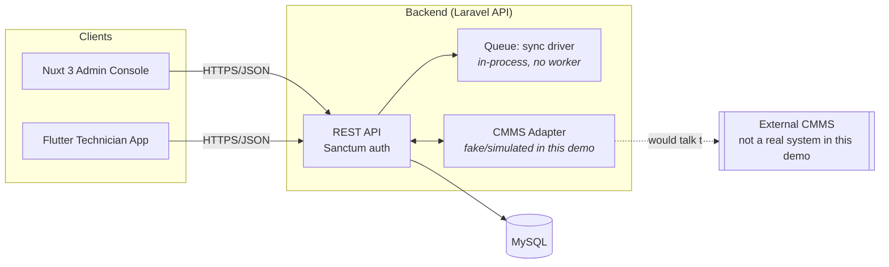

# Enterprise Management Platform

A field-operations platform for managing work orders, asset inspections, and
technician dispatch — a Laravel API, a Nuxt 3 admin console, and a Flutter
mobile app for field technicians, integrating with an external CMMS through
a pluggable adapter layer.

> **Portfolio project.** This began as a commercial proposal that didn't
> move forward, and is now maintained publicly as a demo of the
> architecture and engineering practices behind it. All client-specific
> branding, data, and credentials have been removed or replaced with
> generic placeholders.

## Architecture



There is no separate queue worker or broker (Redis, etc.) — `QUEUE_CONNECTION`
is set to `sync`, so queued jobs run in-process. The "CMMS" integration is a
fake, in-memory adapter used for demos; it stands in for what would be a
real external system's API in production.

## Tech Stack

| Layer    | Stack                                |
|----------|----------------------------------------|
| Backend  | Laravel 10, MySQL, Laravel Sanctum      |
| Frontend | Nuxt 3, Vue 3, Pinia                    |
| Mobile   | Flutter                                 |
| CI       | GitHub Actions — tests, PHPStan/Larastan, ESLint, `composer audit`/`npm audit`, gitleaks |

## Implementation Status

This table reflects the actual current state of the code, not the intended
end state. "Implemented" means backed by a real endpoint *and* wired up in
the corresponding UI; a backend-only or UI-only feature is "Partial."

| Module | Status | Notes |
|---|---|---|
| Auth (login/logout/session) | Implemented | Laravel Sanctum, wired end-to-end (web + mobile). |
| Dashboard KPIs | Implemented | Real endpoint, consumed by the admin dashboard. |
| Work Orders | Implemented | Full backend CRUD; admin UI and lifecycle actions are wired to it. |
| Dispatch (assign/recommend/cancel) | Implemented | Backend + admin UI wired; covered by the project's one real feature test. |
| Technicians (availability/status) | Implemented | Backend + admin UI wired via a Pinia store. |
| Mobile job lifecycle | Implemented | Accept → en route → arrived → in progress → complete, plus GPS and photo evidence upload. |
| CMMS integration | Partial | Sync/health endpoints are real and wired in the UI, but the adapter talks to an in-memory fake CMMS, not a real external system. The "Integrations" page also shows an illustrative matrix of hypothetical integrations (GIS, OLCM, BI dashboard) that don't exist as real connections. |
| Asset registry | Partial | Backend has full CRUD (`AssetController`, form-request validation). The admin page is a read-only preview of mock data, not yet wired to that API — clearly labeled as such in the UI. |
| Inspection forms & records | Partial | Same situation as assets: real backend CRUD (`InspectionFormController`, `InspectionRecordController`), UI still on mock data and labeled as a preview. |
| RBAC / authorization | Planned | Roles are seeded (`spatie/laravel-permission`) but not yet enforced — no Laravel Policies or route-level role checks exist yet. See `SECURITY.md`. |
| Rate limiting / security headers | Planned | Not yet implemented on any route. |
| Real-time updates | Planned | No websocket/broadcast layer currently wired up. |
| Automated tests | Partial | Backend: real feature tests covering the dispatch-assignment guard and a CRLF-injection regression (see `SECURITY.md`), plus framework boilerplate. Frontend and mobile: no test suite yet beyond boilerplate. |
| CI (this workflow) | Implemented | Runs on every push/PR: backend tests against real MySQL, Larastan/PHPStan, `composer audit`; frontend lint, build, `npm audit`; gitleaks secret scanning. |
| Production deployment | Planned | The bundled `docker-compose.yml` runs dev servers (`artisan serve`, `nuxt dev`) and is not production-hardened. |
| Upgrade to a supported Laravel release (12.x) | Planned | Laravel 10 is EOL and carries at least one unpatched CVE on this branch (CVE-2026-48019, mitigated at the application layer for now — see `SECURITY.md`). A major-version upgrade is out of scope for this pass but is the real fix. |

Two settings/user-management pages that existed earlier were removed rather
than finished — they had no real backend behind them and added nothing to
the project's core narrative. Keeping the scope small and honest was judged
better than shipping more half-built menu items.

## Local Setup (Docker)

**Prerequisites:** Docker Engine 24+, Docker Compose v2+.

```bash
cp backend/.env.docker.example backend/.env   # fill in APP_KEY, DB credentials, etc.
docker compose up -d --build
docker compose exec backend php artisan migrate:fresh --seed
docker compose exec backend php artisan storage:link
```

For local development with direct ports (`3000`, `8010`, `8090`):

```bash
docker compose -f docker-compose.dev.yml up -d --build
```

```bash
docker compose up -d              # start all services
docker compose logs -f backend    # tail logs
docker compose down               # stop
docker compose down -v            # stop and reset the database
```

### Demo Data

```bash
docker compose exec backend php artisan demo:reset
# or, with a pre-assigned mobile job:
docker compose exec backend php artisan demo:reset --assign
```

Demo credentials (local only — not real accounts):

| Role       | Email                     | Password |
|------------|----------------------------|----------|
| Admin      | admin@example.com          | password |
| Technician | tech.north@example.com     | password |
| Technician | tech.central@example.com   | password |
| Technician | tech.south@example.com     | password |

See [DEMO_SCRIPT.md](DEMO_SCRIPT.md) for a full walkthrough of the dispatch →
mobile execution → completion flow.

## Screenshots

_TODO: add screenshots of the admin dispatch board and the mobile technician
app here._

## Security

See [SECURITY.md](SECURITY.md) for the threat model, current known
dependency findings, and how to report a vulnerability.

## License

MIT — see [LICENSE](LICENSE).
